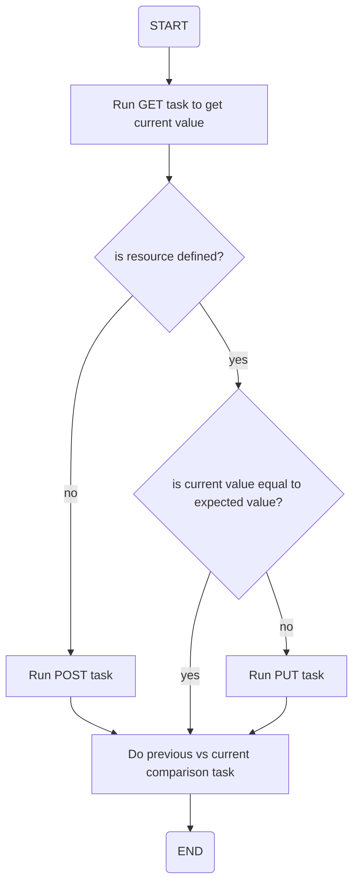

# ansible-role-fortiadc-glb-host

## Description

Ansible role to setup/manage Fortinet's FortiADC GLB Host settings using their HTTP REST API.

Since FAD GLB Host have a recursive dependency (Host -> VSP -> Servers -> Data Center), this role will depends on those roles. You can skip them by using tags. See [About Tags](#about-tags) below for more details. 

This role also include pseudo-idempotency check that kinda looks like this:



## Usage

### Hosts Example

```
# /etc/ansible/hosts

[fortiadc]
fad1.ndkprd.com ansible_host=fad1.ndkprd.com fad_apitoken=mysupersecrettoken
fad2.ndkprd.com ansible_host=fad2.ndkprd.com fad_apitoken=mysupersecrettoken
```

### Needed Vars Example

```
---
# vars.yaml

fad_vdom: root

fad_glb_data_centers:
  - name: hq.ndkprd.com  # Data Center name/mkey
    location: ID  # 2 letters country ID
  - name: dc1.ndkprd.com    
    location: ID     
  - name: dc2.ndkprd.com
    location: ID

fad_dns_policy:
  - name: "DEFAULT_DNS_POLICY" # Global DNS Policy mkey
    source_address: "any" # valid Address Group entry mkey used as source
    destination_address: "any" # valid Address Group entry used as destination
    dns64_list: ""
    dnssec_validate_status: "disable" # "enable" or "disable"
    forward: "first" # "first" or "only"
    forwarders: "" # valid Remote DNS Servers entry mkey
    recursion_status: "disable" # "enable" or "disable"
    rrlimit: "" # valid Response Rate Limit 
    zone_list: "ndkprd.com devops.ndkprd.com infra.ndkprd.com " # is here for documentation purpose only

fad_glb_servers:
  - name: "dmz.hq.ndkprd.com" # GLB Server name/mkey
    data_center: "hq.ndkprd.com" # Data Center name, must exists first
    health_check_ctrl: enable
    health_check_list: "LB_HLTHCK_ICMP " # the whitespace is a must
    health_check_relationship: AND      
    server_type: Generic-Host # "Generic-Host" or "FortiADC-SLB"
    auth_type: none # Only for FortiADC-SLB
    address_type: ipv4 # FAD address type
    auto_sync: disable # Only for FortiADC-SLB
    fad_ipv4: "0.0.0.0" # Only for FortiADC-SLB
    fad_ipv6: "::" # Only for FortiADC-SLB
    fad_pass: "" # Only for FortiADC-SLB
    fad_port: "5858" # Only for FortiADC-SLB
    server_members: []

  - name: "dmz.dc1.ndkprd.com"
    data_center: "dc1.ndkprd.com"
    health_check_ctrl: enable
    health_check_list: "LB_HLTHCK_ICMP "
    health_check_relationship: AND
    server_type: Generic-Host
    auth_type: none
    address_type: ipv4 # FAD address type
    auto_sync: disable
    fad_ipv4: "0.0.0.0"
    fad_ipv6: "::"
    fad_pass: ""
    fad_port: "5858"
    server_members:
      - name: public-waf-1.dmz.dc1.ndkprd.com
        ipv4: 36.92.152.196
        ipv6: "::"
        address_type: ipv4
        gateway: ""
        health_check_ctrl: disable # default value
        health_check_inherit: enable
        health_check_list: ""
        health_check_relationship: OR # default value
      - name: public-waf-2.dmz.dc1.ndkprd.com
        ipv4: 114.5.127.186
        ipv6: "::"
        address_type: ipv4
        gateway: ""
        health_check_ctrl: disable # default value
        health_check_inherit: enable
        health_check_list: ""
        health_check_relationship: OR # default value
  - name: "dmz.dc2.ndkprd.com"
    data_center: "dc2.ndkprd.com"
    health_check_ctrl: enable
    health_check_list: "LB_HLTHCK_ICMP "
    health_check_relationship: AND
    server_type: Generic-Host
    auth_type: none
    address_type: ipv4 # FAD address type
    auto_sync: disable
    fad_ipv4: "0.0.0.0"
    fad_ipv6: "::"
    fad_pass: ""
    fad_port: "5858"
    server_members:
      - name: public-waf-1.dmz.dc2.ndkprd.com
        ipv4: 114.5.119.176
        ipv6: "::"
        address_type: ipv4
        gateway: ""
        health_check_ctrl: disable # default value
        health_check_inherit: enable
        health_check_list: ""
        health_check_relationship: OR # default value

fad_glb_vs_pools:
  - name: public-waf.dc1.ndkprd.com # VS Pools mkey
    check_server_status: enable # healthcheck
    check_virtual_server_existent: enable
    load_balance_method: wrr
    vs_pool_members:
      - id: 1001 # high number of ID for mkey
        is_backup: disable # if enable, when healthcheck failed it will goes to this server
        server: dmz.dc1.ndkprd.com # GLB Servers
        server_member_name: public-waf-1.dc1.ndkprd.com # GLB Servers member
        weight: 100
      - id: 1002
        is_backup: disable
        server:  dmz.dc1.ndkprd.com
        server_member_name: public-waf-2.dc1.ndkprd.com

fad_glb_hosts:
  - name: public_repo.devops.ndkprd.com # GLB Host mkey
    hostname: repo # hostname without domain
    domain: devops.ndkprd.com # base domain without dot
    default_ipv4: "0.0.0.0" # default IP when none of virtual server work
    default_ipv6: "::"
    fortiview: enable
    load_balance_method: "weight"
    persistence: enable
    respond_single_record: enable
    dns_policy: "DEFAULT_DNS_POLICY" # valid DNS Policy mkey
    vsp_lists:
      - mkey: DC1 # vsp_list mkey
        pool_name: waf.dc1.ndkprd.com # existing pool name, MUST EXIST FIRST
        weight: "100" # VS pool weight
      - mkey: DC2
        pool_name: waf.dc2.ndkprd.com
        weight: "1"

```

### Playbook Example

```
---
# ./playbook.yaml

- name: Add global-load-balance host entry in FortiADC.      
  hosts: fortiadc
  become: true
  gather_facts: no
  vars_files:
    - ./vars.yaml

  roles:
    - ndkprd.fortiadc-glb-host
```

### About Tags

I added quiet lots of debug task, mainly to check if the variable I set is correct. These tags basically just print out the var that the previous task set/register. You can skip them altogether by skipping tasks with `debug` tags.

For example, if you're using CLI, you can just go `ansible-playbook playbook.yaml --skip-tags debug`.

As mentioned above, this role recursively depends on my two other FortiADC GLB role: one for GLB Data Center, other for GLB Servers and its members. You can use/skip them with the following tags:

- ndkprd.fortiadc-glb-data-center -> `fad_glb_dc`;
- ndkprd.fortiadc-glb-servers -> `fad_glb_servers` and `fad_glb_servers_members`;
- ndkprd.fortiadc-glb-vsp -> `fad_glb_vs_pools` and `fad_glb_vs_pools_members`.

## License

MIT, use at your own risk.